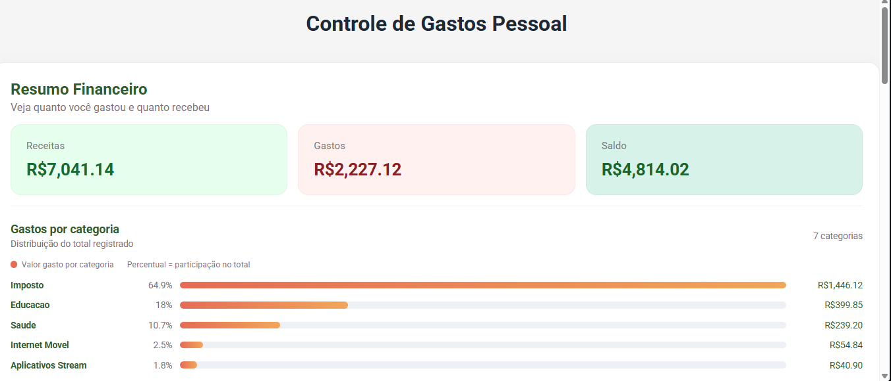

# App Controle de Gastos

Aplicacao web para registrar e acompanhar gastos, receitas e investimentos em um unico painel. O resumo financeiro mostra os totais, o saldo atual e um grafico de barras com a distribuicao dos gastos por categoria.

O frontend foi desenvolvido com Angular 21 e usa uma API local baseada em `json-server` durante o desenvolvimento.

## Tela inicial



## Funcionalidades

- Cadastro de gastos, receitas e investimentos.
- Validacao de valores maiores que zero nos formularios financeiros.
- Historico unificado de transacoes, ordenado por data.
- Exclusao de transacoes diretamente pelo historico.
- Resumo de receitas, gastos e saldo.
- Grafico de gastos por categoria com valor e participacao percentual.
- Layout responsivo para desktop e telas menores.

## Requisitos

- Node.js compativel com Angular 21.
- npm 11. O projeto declara `npm@11.5.2` em `package.json`.

## Instalacao

Na raiz do repositorio, entre na pasta que contem o `package.json` e instale as dependencias:

```bash
cd app-gastos/app-controle-gastos
npm install
```

## Executar localmente

O comando recomendado inicia o frontend e a API mock ao mesmo tempo:

```bash
npm run dev
```

Depois, abra `http://localhost:4200/` no navegador.

O frontend Angular usa a API em `http://localhost:3000`. Para executar os processos separadamente, use dois terminais:

```bash
# Terminal 1
npm run mock

# Terminal 2
npm start
```

O arquivo `mock/assets/db.json` funciona como banco inicial. Alteracoes feitas por POST, PUT ou DELETE sao gravadas nesse arquivo enquanto o mock estiver ativo.

## API local

| Recurso | Operacoes |
| --- | --- |
| `/gastos` | `GET`, `POST`, `PUT`, `DELETE` |
| `/receitas` | `GET`, `POST`, `PUT`, `DELETE` |
| `/investimentos` | `GET`, `POST`, `PUT`, `DELETE` |

Todos os recursos ficam disponiveis em `http://localhost:3000` e usam o campo `id` para identificar cada registro.

## Scripts

| Comando | Finalidade |
| --- | --- |
| `npm start` | Inicia o servidor de desenvolvimento Angular em `http://localhost:4200`. |
| `npm run mock` | Inicia o `json-server` em `http://localhost:3000`. |
| `npm run dev` | Inicia Angular e API mock simultaneamente. |
| `npm run build` | Gera o build de producao em `dist/app-gastos`. |
| `npm run watch` | Recompila automaticamente em modo desenvolvimento. |
| `npm test` | Executa os testes unitarios com Vitest. |
| `npm run serve:ssr:app-gastos` | Serve o build SSR gerado previamente. |

## Validacao

```bash
npm run build
npm test -- --watch=false --progress=false
```

O build nao depende da API mock. Para validar os fluxos de cadastro, carregamento e exclusao, execute `npm run dev` e teste a aplicacao com os dois servidores ativos.

## Estrutura do projeto

```text
src/app/
	core/service/              Comunicacao com a API local.
	modules/home/              Tela principal e componentes financeiros.
		components/gasto/        Formulario de gastos.
		components/receita/      Formulario de receitas.
		components/investimento/ Formulario de investimentos.
		components/resumo/       Totais, saldo e grafico por categoria.
		components/historico/    Lista e exclusao de transacoes.
mock/assets/db.json          Dados iniciais da API mock.
```

## Tecnologias

- [Angular](https://angular.dev/) 21
- TypeScript
- SCSS
- [RxJS](https://rxjs.dev/)
- [Angular Font Awesome](https://github.com/FortAwesome/angular-fontawesome)
- [json-server](https://github.com/typicode/json-server)

## Licenca

Este projeto esta disponivel sob a [Licenca MIT](../LICENSE). Consulte o arquivo `LICENSE` para ver os termos completos.
